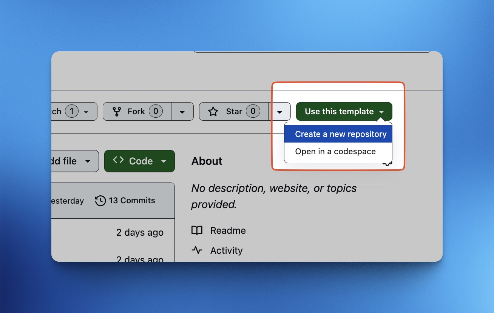
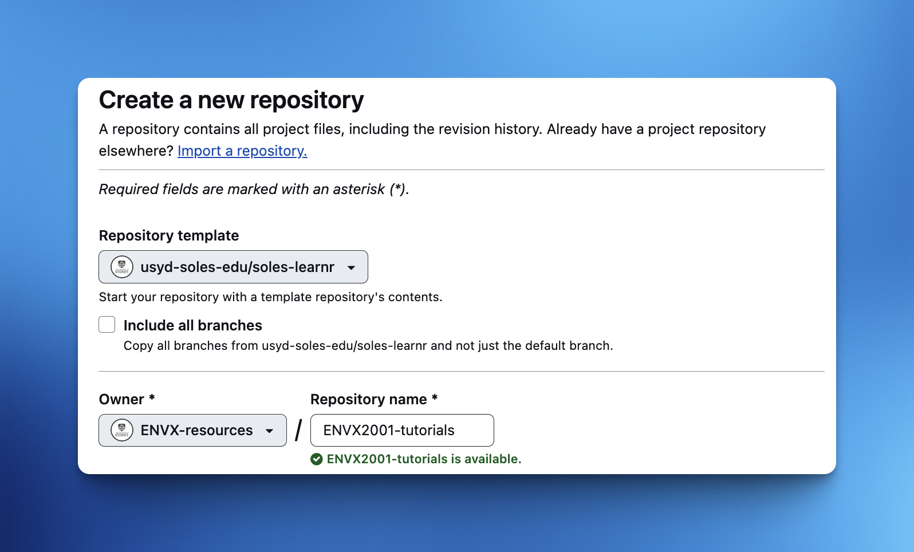
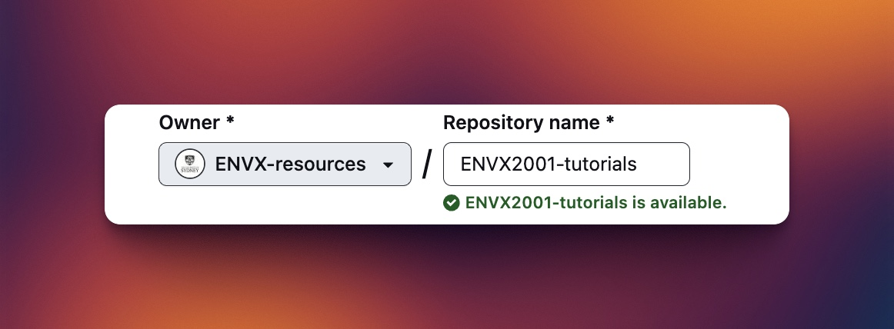

```{r setup, eval=TRUE, include=FALSE}
library(learnr)
knitr::opts_chunk$set(echo = TRUE)
```


## Introduction

This is a template for creating interactive tutorials using the [`learnr`](https://rstudio.github.io/learnr/) package in R. Anyone using this template is expected to have a basic understanding of R and RStudio, GitHub and the .git workflow.


*This document is developed using resources that are available under a [Creative Commons Attribution 4.0 International license](https://github.com/usyd-soles-edu/.github/blob/main/cc-by), made available on the [SOLES Open Educational Resources repository](https://github.com/usyd-soles-edu).*

### Why `learnr`?

The `learnr` package creates interactive tutorials that can be hosted online. Interaction is done through a [Shiny](https://www.rstudio.com/products/shiny/) framework, which is embedded in the document. Features include the ability to run code within the document itself, and to provide responsive feedback to students.

## Deployment

There are many ways to deploy `learnr` documents, but we will only be covering one method here as it is not well documented. For other established methods of deployment, please refer to the [official documentation](https://rstudio.github.io/learnr/articles/publishing.html).

### Binder

[Binder](https://mybinder.org/) is a free service that allows you to host interactive documents online for *free*. However, Binder is not a commercial service, so there are no guarantees that your document will be available at all times. Nevertheless it is a good way to get started with `learnr` documents if you are on a tight educational budget.

*Click on "Continue" for instructions.*

### Instructions

Before we begin, you will need to have a GitHub account. If you don't have one, you can [sign up for free](https://github.com/signup). You are also expected to understand the .git workflow, where you will stage, commit, push and pull from the repository. If you need help with .git, check this guide [here](https://happygitwithr.com/rstudio-git-github.html).

### Step 1: Create a new repository from the Template

Go to the [soles-learnr](https://github.com/usyd-soles-edu/soles-learnr) repository on GitHub. Click on the "**Use this template**" button. Then select "**Create a new repository**". 

{width=100%}

### Step 2: Give the new repository a name

Give your new repository a name. Other options can be left to default. Once you are happy, click on "**Create Repository**". Below we have named the repository `ENVX2001-tutorials`.

{width=100%}

### Step 3: Edit the link to the Binder site

Once the repository has been created, you will need to change the link to the Binder site to point to your repository. This link is in your `README.md` file.

By default, the link is *https:<area>//mybinder.org/v2/gh/**usyd-soles-edu/soles-learnr**/main?urlpath=shiny/tutorial/learnr.Rmd*

In our example, we have created a repository called `ENVX2001-tutorials` under the owner called `ENVX-resources`.

{width=100%}

So, the link to the Binder site should be changed to *https:<area>//mybinder.org/v2/gh/**ENVX-resources/ENVX2001-tutorials**/main?urlpath=shiny/tutorial/learnr.Rmd*

Note that if you change your file name or move it to a different directory, you will need to update the link accordingly, specifically the last part of the link i.e. *...urlpath=shiny/**tutorial/learnr.Rmd***. For example, if the file name is changed to `tutorial_01.Rmd` and you move the file to a different folder called `Module01` then the link should be changed to *...urlpath=shiny/**Module01/tutorial_01.Rmd***.

### Step 4: Adjust R dependencies, finalise and test

Edit the document as you see fit, and knit often to view the changes locally.

Once you are done, you will need to ensure that your R dependencies are included in Binder. Edit `environment.yml` to include all the R packages that you used in your document. This allows Binder to install them before trying to knit the final document. Below is the contents of the `environment.yml` file for this document.

```{yaml, eval=FALSE}
channels:
  - conda-forge
dependencies:
  - r-base>4.3.0
  - r-learnr
```

**Make sure all your changes are committed to the repository before you test the link!**

## Basic usage

### Questions

```{r q1, echo=FALSE}

hitchhiker <- "Unfortunately, you will need to have read the Hitchhiker's Guide to the Galaxy (*or read enough references to this*) to answer the question."

question("What is the answer to life, the universe and everything?",
  answer("42", correct = TRUE),
  answer("24", message = hitchhiker), 
  answer("404", message = hitchhiker), 
  answer("666", message = hitchhiker),
  random_answer_order = TRUE
)
```


### Exercises

```{r ex1, exercise=TRUE}
# Find out how many variables there are in the mtcars dataset 
# using any method you like.
mtcars
```
<div id="filter-hint">
**Hint:** You need a function that returns the number of columns in a data frame.
</div>

```{r ex1-solution}
# All of these are possible
ncol(mtcars)
length(mtcars)
dim(mtcars)[2]
```


## Thanks

You have reached the end of this tutorial. If you have any questions, send us a message in the form of an issue on the [soles-learnr](https://github.com/usyd-soles-edu/soles-learnr) repository on GitHub
